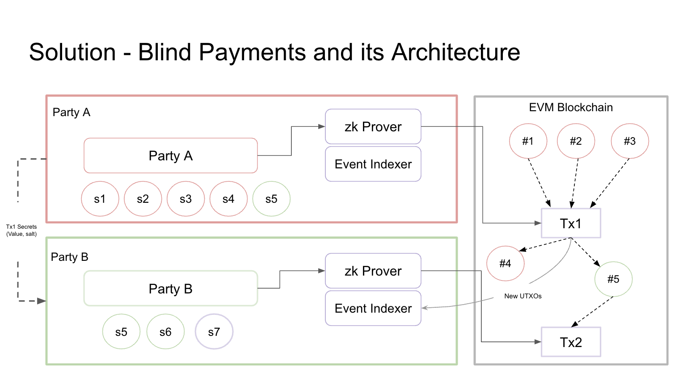

# ETH_Tokyo_2024

## Summary

We're building a silent payment solution that allows users on EVM chains to send payments to another person in completely private and anonomyous way, meaning only the sender and recipient would know the details of the actual transaction.

Silent payment is something that is already executable on Bitcoin. For this to work on Ethereum, we are basically borrowing an open-source library that allows us to create a UTXO based privacy-preserving token using ZKP.

## Problem & opportunity
Transactions on EVM chains are completely open for everyone to see, so users can easily see what everyone else are doing/sending. However, there are certain situations where one may wanna send a payment to someone without letting the whole world know about it. For example, sending money to support a political dissident, or sending crypto to support an independent journalist.

## Solution
We have created an easy-to-use app that allows users to send payment to a recipient anonymously after logging in.

### Technology architecture and customer flow

## User Flow

## Future Work
Some thoughts for how the whole project can be built out further:
-

## Deployed contract (all verified)
### Scroll Sepolia Testnet  (chainID: 534351)
| Contract |                           Contract address |
| :------- | -----------------------------------------: |
|   |  |
Contract link:

### Arbitrum Sepolia testnet (chainID: 421614)

| Contract    |                           Contract address |
| :---------- | -----------------------------------------: |
|     |  |
The verified smart contract on Arbitrum Sepolia testnet is:

### Linea testnet (chainID: 59140)

| Contract    |                           Contract address |
| :---------- | -----------------------------------------: |
|    |  |
The verified smart contract for Linea testnet is:

## Others

### Demo movie

### Demo site

### How to run locally
1.
2.
3.
